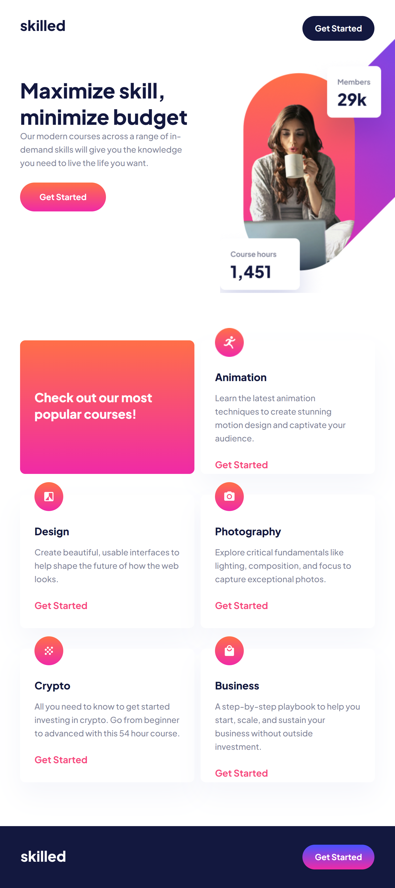
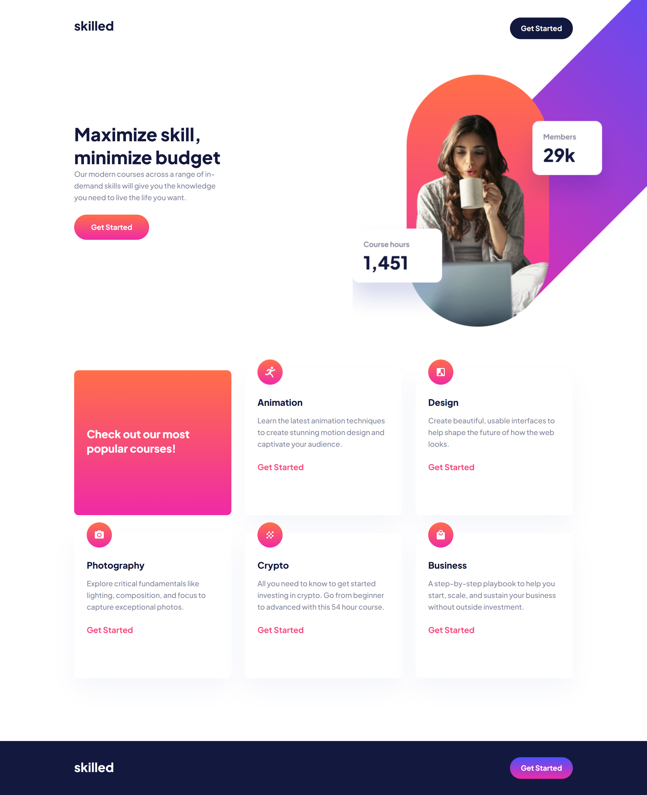

# skilled-learn-landing-page
frontend landing page for a new e-learning platform

Skilled E-Learning Landing Page
Skilled E-Learning Landing Page is a modern and visually appealing website template designed for showcasing online courses. The landing page is responsive and offers a seamless user experience across different devices.

Table of Contents

## Features

**Responsive Design:** The landing page is fully responsive, ensuring a great user experience on various devices and screen sizes.
Modern and Clean UI: The user interface is designed with a modern and clean aesthetic, making it visually appealing.

**Easy Customization:** The code is well-organized and can be easily customized to fit different branding needs.

